<div align="center">


# PhDude

A research co-author harness for AI coding agents: your agent does the reading and the writing,
PhDude keeps the record, the evidence and the approvals.

[](https://github.com/LucioY250/phdude/actions/workflows/ci.yml)
[](CHANGELOG.md)
[](LICENSE)



</div>

## Install

```
git clone https://github.com/LucioY250/phdude && cd phdude
npm ci
npm link
```

Once it is on npm: `npm install -g phdude`. Node 22 or newer.

## The 60-second tour

```
phdude init --title "Edge scheduling"        # create the workspace and its agent files
phdude ingest                                # hash and cache whatever is in sources/
phdude add claim --json '{"statement":"…"}'  # a candidate; not a fact until you decide
phdude next                                  # the next action, its reasons, its command
phdude research "tail latency" --question RQ-1  # ask the literature, if policy allows
phdude manuscript submit introduction --file draft.md  # the draft, through the gates
phdude build --format docx                   # approved sections, in the venue's order
phdude ready                                 # exits 2 while anything blocks submission
```

Every one of them takes `--json`.

## Use it with your agent

```
phdude init --agents claude-code|codex|opencode
```

Open the agent in that directory. Start with `/phdude bootstrap`.

## Principles

Human authority: nothing becomes fact without your decision.

Provenance: every number points at the source it came from.

No detector scores, ever — not computed, not estimated, not optimized for.

## Read more

- [docs/guide.md](docs/guide.md) — the long version: how it works, and every part of the loop worked through end to end.
- [docs/cli.md](docs/cli.md) — every command, every flag, every exit code.
- [docs/agents.md](docs/agents.md) — Claude Code, Codex, OpenCode, or anything that reads `AGENTS.md`.
- [docs/extending.md](docs/extending.md) — where a change belongs: core, skill, pack or adapter.
- [examples/](examples/) — four generated workspaces, in four different fields.
- [CHANGELOG.md](CHANGELOG.md) — what changed in every release.
