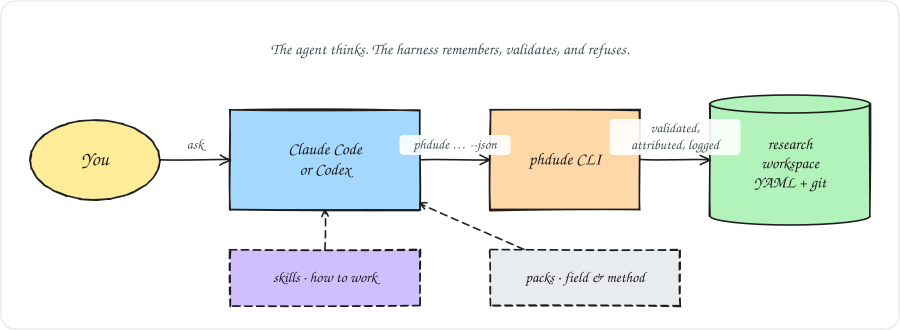
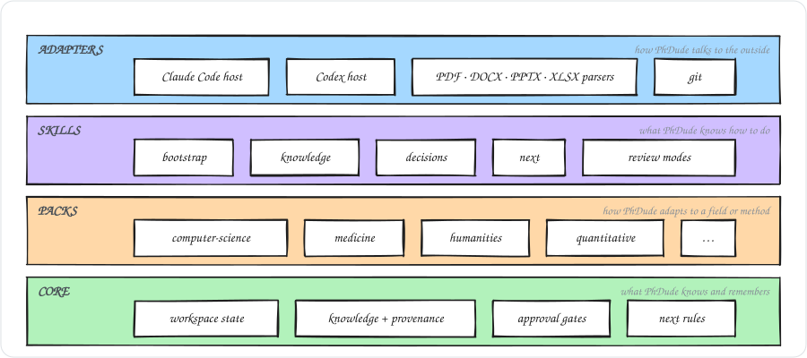
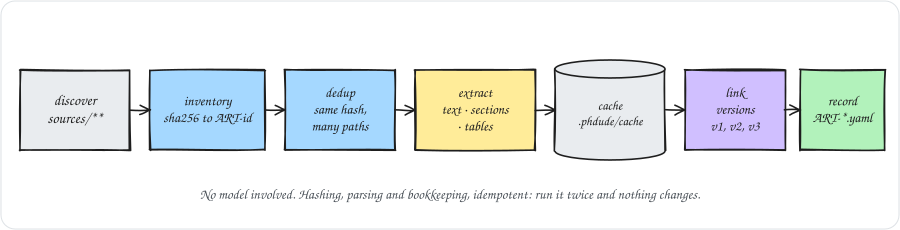
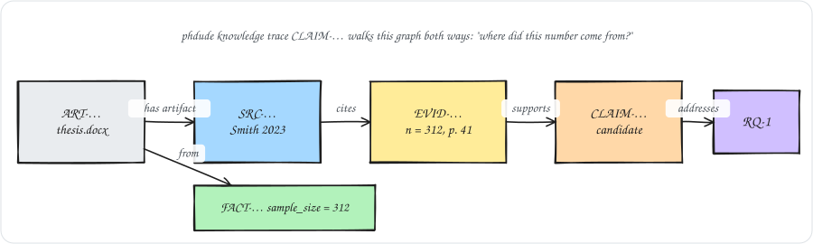
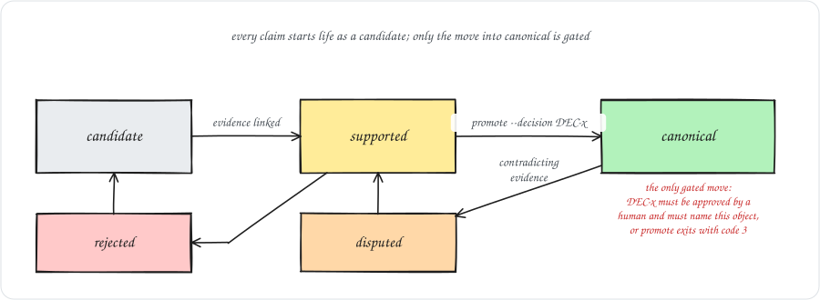
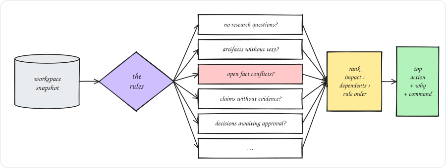

<div align="center">


# PhDude

**The senior researcher in your terminal.**

Your AI can write. PhDude helps make the research worth publishing.

[](https://github.com/LucioY250/phdude/actions/workflows/ci.yml)
[](CHANGELOG.md)
[](package.json)
[](LICENSE)
[](#set-up-your-agent)

</div>

---

Coding agents are already good at the individual tasks of research: find a paper, summarize
it, draft a section, run a regression. What they are bad at is the *project*. They forget what
you decided last month, they state a shaky claim as fact because it reads well, and they have
no idea that the sample size in your thesis draft disagrees with the one in your defense slides.

PhDude is the part that remembers. It is a free, open-source harness that wraps Claude Code,
Codex or any agent that reads `AGENTS.md` in a persistent, evidence-aware research workspace,
so the agent behaves like a senior colleague who has actually read your project:

- **it knows what you are trying to establish**, what evidence exists, and what is missing;
- **it will not let a claim outrun its evidence**: every claim carries an explicit knowledge
  state, and nothing becomes "canonical" without a decision you approved;
- **it notices contradictions** between your own documents before a reviewer does;
- **it always has an answer to "what should we do next?"**, with the reasons attached.

It makes no assumptions about your field. A clinical trial, an archival history and an
empirical software-engineering paper get the same treatment; discipline-specific vocabulary
and review questions arrive as packs.

> **Where things stand.** This is v0.3. The deterministic core is done and tested: workspace,
> ingestion, the knowledge graph, decisions, conflict detection, packs, `status` and `next`, the
> citation registry, the literature matrix and gap report, workspace migrations, and the Claude
> Code and Codex adapters. New in this release, PhDude can go and *find* literature: five search
> providers, candidate review, freshness tracking. The network is off until you turn it on, and
> nothing from your documents ever leaves the machine. Analysis execution and the writing engine
> come next; see the [roadmap](#roadmap).

## What's new in 0.3

v0.3 is the Research Engine. Until now PhDude only knew what you gave it. Now it can go and
look — carefully, under a policy you control, and with a receipt for every call.

- **Literature search.** `phdude research "…" --question RQ-1` queries OpenAlex, Crossref,
  arXiv, Semantic Scholar and PubMed, merges what comes back into one candidate per paper, and
  records the search. Two providers returning the same work give you one row, not two: they
  match on DOI, or on title and year.
- **Candidate review.** A search result is not a source. It lands as a `CAND-` record and stays
  there until you say otherwise. `phdude research accept` turns one into a `SRC-` with its
  identifiers and its provenance; `phdude research dismiss --reason "…"` records why one is not
  going in, so the next reader knows it was read rather than missed.
- **The network is off by default.** Nothing reaches a provider unless
  `.phdude/research-policy.yaml` says `network.enabled: true` or the call carries
  `--allow-network`. Nothing from your documents goes with the query; [what actually leaves your
  machine](#what-actually-leaves-your-machine) is the exact list. Every call appends an event
  with the provider, the query and a result count — never a result payload — so the workspace
  can always say exactly what it asked, of whom, and when.
- **Freshness.** `phdude freshness` reports the last search behind every research question, how
  long ago it ran, and whether the policy calls that stale. `phdude research-fresh` re-runs the
  stale ones exactly as they ran the first time and reports **only what is new** — "nothing has
  changed since March" is a real answer, and a better one than the same twenty papers again.
  `gaps` and `next` learned the matching rules.
- **Editing, finally.** `phdude edit <id> --json '{"venue":"…"}'` corrects the non-identity
  fields of a non-canonical object in place. It refuses three things, and each refusal is the
  point: a canonical object (propose a decision), an identity field (the id is derived from it),
  and a field the schema does not know.

## Contents

- [What's new in 0.3](#whats-new-in-03)
- [How it works](#how-it-works)
- [Install](#install)
- [Set up your agent](#set-up-your-agent) (Claude Code, Codex, anything else)
- [A first session](#a-first-session)
- [Finding literature](#finding-literature)
- [What's in the box](#whats-in-the-box)
- [Your workspace](#your-workspace)
- [Commands](#commands)
- [Packs](#packs)
- [Principles](#principles)
- [Roadmap](#roadmap)
- [Contributing](#contributing)

## How it works

The agent thinks. The harness remembers, validates, and refuses.

<p align="center"></p>

The agent never edits research state by hand. It goes through the CLI, so every change is
schema-validated, attributed to a researcher and an agent, and appended to an audit log. Four
kinds of parts make this up:

<p align="center"></p>

### Where the knowledge comes from

Drop documents in `sources/` and run `phdude ingest`. Nothing here involves a model: it is
hashing, parsing and bookkeeping, and it is idempotent.

<p align="center"></p>

The agent then reads the cached text section by section, never whole documents, and turns it
into research objects through `phdude add`: sources, facts with their locators, evidence, and
candidate claims. Everything it adds points back to where it came from:

<p align="center"></p>

`phdude knowledge trace CLAIM-…` walks this graph in both directions, so "where did this number
come from?" has an answer.

### How a claim earns the right to be stated plainly

<p align="center"></p>

The transition into `canonical` is the only one the CLI gates, and it gates it hard: without an
approved decision that lists the object, `phdude promote` exits with code 3. An agent cannot
talk its way around it, and neither can a tired researcher at 2 a.m.

### How "what next?" is decided

<p align="center"></p>

Every rule is deterministic and every recommendation carries its reasons, its impact, and the
command that does it. There is no hidden score.

## Install

v0.3 is not on npm yet. Install it from the repository:

```
git clone https://github.com/LucioY250/phdude && cd phdude
npm ci
npm link
phdude --version      # phdude 0.3.0
```

Node 22 or newer. `pdftotext` (poppler-utils) is optional: without it PDFs are still
inventoried and hashed, and `phdude doctor` tells you exactly what is missing.

```
sudo apt install poppler-utils     # Debian / Ubuntu
brew install poppler               # macOS
```

## Set up your agent

`phdude init` creates the workspace and writes the files each agent host needs. The research
state is identical whichever agent you use, and two people on two different agents can share
one repository.

### Claude Code

```
mkdir my-research && cd my-research
phdude init --title "Adaptive scheduling in edge clusters" --agents claude-code
```

This writes:

| File | Purpose |
|---|---|
| `CLAUDE.md` | Entry point. Imports `AGENTS.md` and adds Claude-specific notes. |
| `AGENTS.md` | Operating rules, the command reference, and an *index* of skills. Skills are loaded on demand, not up front, to keep your context small. |
| `.claude/commands/phdude*.md` | Slash commands, one per CLI command: `/phdude` (the dispatcher), `/phdude-init`, `/phdude-bootstrap`, `/phdude-ingest`, `/phdude-status`, `/phdude-next`, `/phdude-knowledge`, `/phdude-add`, `/phdude-link`, `/phdude-decide`, `/phdude-promote`, `/phdude-cite`, `/phdude-research`, `/phdude-research-fresh`, `/phdude-freshness`, `/phdude-edit`, `/phdude-matrix`, `/phdude-gaps`, `/phdude-manuscript`, `/phdude-prose`, `/phdude-packs`, `/phdude-mode`, `/phdude-migrate`, `/phdude-doctor`, `/phdude-help`. |
| `.phdude/skills/*/SKILL.md` | The skills themselves, in the open `SKILL.md` convention. |

Open Claude Code in the directory and start with:

```
/phdude bootstrap
```

`/phdude` on its own reports status and the top next action. `/phdude ruthless` (or `lite`,
`full`, `off`) sets how hard the agent pushes back. Every slash command runs the CLI with
`--json` and follows the matching skill; the commands are allow-listed to `phdude` only.

### Codex

```
mkdir my-research && cd my-research
phdude init --title "Adaptive scheduling in edge clusters" --agents codex
```

Codex has no slash commands and no on-demand skill loading, so it gets one file:

| File | Purpose |
|---|---|
| `AGENTS.md` | Operating rules, the command reference, and every skill inlined in full. Codex reads it at the start of each session. |

Open Codex in the directory and ask it to bootstrap the research workspace. It will run
`phdude bootstrap --json`, follow the bootstrap skill, and report what the project is, what is
known, what conflicts, and what to do next. From then on ask it for status, the next action, or
any `phdude` command by name.

### Both, or another agent

```
phdude init --title "…" --agents claude-code,codex
```

is the default, and gives you both sets of files; the compact skills index wins for `AGENTS.md`, since Claude Code
loads skills on demand and Codex still finds them by path. Any other agent that reads
`AGENTS.md` (OpenCode, Gemini CLI, and most others) works the same way as Codex. If yours reads
nothing by default, point it at `.phdude/skills/phdude-core/SKILL.md` and it has the rules.

`init` never overwrites a `CLAUDE.md` or `AGENTS.md` you wrote yourself; it only manages files
that carry its own marker, and it tells you which ones it skipped.

## A first session

```
cp ~/Downloads/*.pdf ~/Downloads/*.docx sources/
```

Then `/phdude bootstrap` (Claude Code) or `phdude bootstrap` (Codex, or you). PhDude
inventories and hashes every file, extracts and caches the text, and hands the agent a plan:
classify the artifacts, pull out sources, facts and candidate claims, propose research
questions for you to confirm. From then on you talk to your project:

```
phdude status     # what the project is, what is known, what conflicts
phdude next       # the highest-impact next action, and why
```

`phdude next` never just tells you what to do. It shows its work:

```
Highest-impact next action:

Resolve the conflicting value(s) for "sample_size"

Why:
- sample_size: 312 participants (ART-35146e2f6d, ART-0772a215de) vs 300 participants (ART-f7ced78004)
- 3 claim(s) depend on the conflicting artifacts

Expected impact:
HIGH

Command:
phdude decide propose --title "Resolve sample_size" --rationale "…" --affects FACT-2bc4462edb FACT-54af7fa906 FACT-f62e1a2f34 --change '{"fact_key":"sample_size","canonical_value":…}'

Other candidates:
1. (medium) Review the research gaps report
2. (medium) Classify artifacts with unknown role
3. (medium) Refresh the literature behind the research questions
4. (medium) Approve or reject pending decisions
5. (medium) Close the evidence gap for unaddressed research questions
6. (low) 15 open gap(s); run phdude gaps
```

That block is the real output of `phdude next` on the [example workspace](examples/generic-thesis)
that ships with the repository. The workspace was generated by a script from the same CLI you
will use; nothing in it is hand-written.

When the agent proposes a decision, you approve it by name, and only then can the object it
names become canonical:

```
phdude decide approve DEC-… --by lucio
phdude promote CLAIM-… --decision DEC-…
```

## Finding literature

By default PhDude never touches the network. Turning that on is a two-line edit to
`.phdude/research-policy.yaml`, which is also where you say who you want searched and what
counts as a paper worth returning:

```yaml
network:
  enabled: true              # nothing leaves the machine until this is true

skills:
  allow_network: true        # installs the research skill your agent follows

providers: [openalex, crossref, arxiv]   # also available: semantic-scholar, pubmed

research:
  year_range: { from: 2021 }
  languages: [en, es]
  peer_reviewed: preferred   # preferred | required | any
  preprints: { require_approval: true }
  freshness: { stale_after_days: 180 }
  limit: 20                  # per provider, not a total
```

`skills.allow_network` is a separate switch on purpose: it is what lets `phdude init` install
the `research` skill, which is the one skill that touches the network. Run `phdude init` again
after you set it, and the skill lands in `.phdude/skills/research/`.

Then ask a question of the literature, tied to one of your research questions:

```
phdude research "note-taking app adoption undergraduates" --question RQ-1
```

Every provider in the list gets the same query. What comes back is deduplicated into one
candidate per paper — same DOI, or same title and year — merged so a field one provider left
empty is filled by one that reported it, and ranked by a score that is written down rather than
hidden (`score_parts` explains it in `--json`). None of it is knowledge yet:

```
phdude research list --state candidate
phdude research show CAND-…
phdude research accept CAND-… --type article
phdude research dismiss CAND-… --reason "measures a different construct"
```

`accept` is the only path from a search result into your citation registry. It creates the
`SRC-` record with whatever identifiers the providers actually reported, notes where it came
from, and invents nothing — run `phdude cite check` afterwards and it will tell you what is
still missing. A preprint needs `--approve-preprint` on top, because
`preprints.require_approval` says a preprint is your call, not the tool's.

Literature ages whether or not anyone looks at it:

```
phdude freshness                   # last search per question, age per source, what is stale
phdude research-fresh --question RQ-1
```

`research-fresh` re-runs a stale search exactly as it ran the first time and tells you only what
is new.

### What actually leaves your machine

A provider call carries exactly this, and nothing else:

- **the query string** — what you or your agent typed, verbatim;
- **the result limit and the `from` year** (`research.limit` and `research.year_range.from`, or
  `--limit` and `--from`), sent as that provider's own filter parameters;
- **a `phdude/<version>` User-Agent**, so an API owner can see who is asking;
- **your `email` from `.phdude/author-profile.yaml`**, as the polite `mailto` that OpenAlex and
  Crossref ask for — only to those two, and only if you filled one in;
- **`PHDUDE_S2_API_KEY`**, as an `x-api-key` header, only to Semantic Scholar, only if it is set;
- **`PHDUDE_NCBI_API_KEY`**, as the `api_key` query parameter NCBI documents, only to PubMed,
  only if it is set.

Nothing from your workspace goes with it: no document, no excerpt, no filename, no path, no
title of anything you ingested. Both API keys are read from your environment and never from the
workspace, and neither one reaches an error message or the event log. Every call appends one
line to `.phdude/events.jsonl` naming the provider, the query and how many results came back — a
failed call included, because the query left the machine either way:

```json
{"ts":"…","op":"search","actor":{…},"ids":["SEARCH-7c2d4e6a10"],"summary":"openalex: \"open science practices\" → 3 results"}
```

`phdude doctor` prints the policy and the configured providers without calling anything.

Your agent is held to the same rule: the core skill forbids it from fetching a paper, an
abstract or a DOI on its own, by any means. If the policy is closed, it reports that and asks
you — it does not pass `--allow-network` on your behalf.

## What's in the box

```
phdude/
├── bin/phdude.js          the CLI entry point
├── src/
│   ├── domain/            pure logic: ids, hashing, lineage, conflicts, gaps, candidates, rules
│   ├── application/       use cases: init, ingest, add, link, decide, cite, research, edit, …
│   ├── ports/             the contracts adapters implement (+ their contract test suites)
│   ├── adapters/          filesystem store, document parsers, git, search providers, agent hosts, CLI
│   └── schemas/           the JSON Schema validator
├── schemas/               one JSON Schema per research object, plus the skill contract
├── migrations/            one module per workspace-version step
├── skills/                the eight core skills, one SKILL.md directory each
├── commands/              the Claude Code slash-command templates
├── packs/                 seven starter packs: fields/ and methods/
├── defaults/              the research constitution and policies a new workspace gets
├── examples/              a complete generated workspace, used by the golden tests
├── docs/                  CLI reference, workspace guide, extending guide, ADRs
└── tests/                 unit · contract · integration · golden · e2e (node:test only)
```

Three runtime dependencies (`yaml`, `ajv`, `fflate`). The only code that can reach the network
is a search provider under `src/adapters/search/`, and only `phdude research` and
`phdude research-fresh` can call one — under the policy above. The domain layer cannot import
the filesystem, and a test makes sure it never does.

## Your workspace

```
my-research/
├── phdude.yaml          # project: title, fields, methods, outputs, mode, workspace_version
├── AGENTS.md            # shared agent instructions
├── CLAUDE.md            # Claude Code entry point
├── .claude/commands/    # slash commands (Claude Code)
├── .phdude/
│   ├── constitution.yaml, research-policy.yaml, writing-policy.yaml, …
│   ├── skills/          # installed skills
│   ├── events.jsonl     # append-only audit log
│   └── cache/           # extracted text, gitignored, rebuildable
├── sources/             # the raw materials you drop in
├── authors/             # voice profiles (v0.4)
├── knowledge/
│   ├── artifacts/       # ART-*.yaml   one per unique file
│   ├── sources/         # SRC-*.yaml   bibliographic sources
│   ├── claims/          # CLAIM-*.yaml
│   ├── evidence/        # EVID-*.yaml
│   ├── facts/           # FACT-*.yaml  project facts with their origin
│   ├── results/         # RESULT-*.yaml
│   └── candidates/      # CAND-*.yaml  literature hits awaiting your verdict, not yet sources
├── research/            # questions/ RQ-*.yaml · hypotheses/ H-*.yaml · methods/ METH-*.yaml
│                        # searches/  SEARCH-*.yaml  what was asked, of whom, and when
├── decisions/           # DEC-*.yaml
├── references.bib       # written by `phdude cite export`; derived, not knowledge
└── data/ analysis/ figures/ tables/ manuscript/ templates/ outputs/
```

One object per file, content-derived ids, schema on every file. Plain YAML and Markdown under
git: you can read, diff, review and merge all of it without PhDude installed, and if you stop
using it you keep a folder, not a database dump. Details in [docs/workspace.md](docs/workspace.md).

## Commands

| Command | What it does |
|---|---|
| `phdude init [dir]` | Create a workspace. Safe to run again. |
| `phdude bootstrap` | Ingest, detect packs, report status and next, hand off to the agent. |
| `phdude ingest [paths…]` | Inventory, hash, extract and cache source documents. |
| `phdude status` | Project, inventory, knowledge counts, conflicts, pending decisions. |
| `phdude next` | The highest-impact next action, with reasons and the exact command. |
| `phdude knowledge list\|show\|trace` | Query the knowledge graph and follow its lineage. |
| `phdude add <type>` | Add a claim, evidence, fact, source, question, hypothesis, method or result; set an artifact's role with `add artifact-role`. |
| `phdude link <id> --to <ids…>` | Attach evidence to a claim, a claim or method to a question, an artifact to a source. |
| `phdude decide propose\|approve\|reject\|supersede` | Research decisions. The agent proposes; the researcher decides. |
| `phdude promote <id> --decision <DEC-id>` | Make an object canonical, with an approved decision behind it. |
| `phdude cite list\|check\|export` | Citation registry: list sources, verify them, export BibTeX/CSL-JSON. |
| `phdude research "<query>"\|list\|show\|accept\|dismiss` | Search the literature through the configured providers and record what came back as candidates to review. Refuses unless the network policy allows it. `accept` turns a reviewed candidate into a source; `dismiss` records why one is not going in. |
| `phdude research-fresh [--question RQ-n] [--all]` | Re-run the recorded searches that have gone stale, and report only what is new. |
| `phdude freshness` | Last search per research question, age per source, and what the policy calls stale. |
| `phdude edit <id> --json '<fields>'` | Correct the non-identity fields of a non-canonical object. Identity fields are never editable. |
| `phdude matrix [--format md\|csv] [--question RQ-n]` | Literature matrix: one row per source, which questions and claims it reaches. |
| `phdude gaps` | Research gaps: questions, claims, sources, artifacts and conflicts that need attention. |
| `phdude prose --file <path> [--lang en\|es]` | Academic Prose Quality report for a text file: six located sub-scores and the observations behind them. Never an AI-detector score. |
| `phdude manuscript init\|list\|show <s>\|status\|submit <s>\|approve <s>\|reopen <s>` | The manuscript: plan its sections, submit a draft through the writing gates, approve a section with a decision behind it. |
| `phdude packs list\|detect\|apply <name>` | Field and method packs. |
| `phdude mode lite\|full\|ruthless\|off` | How hard the agent pushes back. |
| `phdude migrate [--dry-run]` | Upgrade a workspace written by an older PhDude. |
| `phdude doctor` | Adapters, cache, schema versions, skill permissions, git state. |
| `phdude help` | The command list, the global options, and what each exit code means. |

Every command takes `--json`. Exit codes mean something: 0 ok, 1 usage, 2 validation,
3 policy, 4 external tool missing. Errors come with a suggested action. The full reference is
in [docs/cli.md](docs/cli.md).

## Packs

Seven packs ship today: four fields (`computer-science`, `business`, `medicine`,
`humanities`) and three methods (`quantitative`, `qualitative`, `systematic-review`). Each
brings terminology, reviewers, recommended checks and a skill with concrete review questions
and the epistemic norms of its discipline, so "demonstrates" and "suggests" are used the way
that field uses them. `phdude packs detect` recommends packs from what it finds in your
sources; nothing is applied until you say so.

Writing your own is a `pack.yaml` and a `SKILL.md`: see [docs/extending.md](docs/extending.md).

## Principles

- **Research quality over text generation.** The goal is publishable research, not fluent prose.
- **Evidence determines language strength.** Nothing is stated more confidently than its
  knowledge state allows.
- **Human authority.** Research questions, methodology, accepted results and canonical claims
  belong to the researcher. The agent proposes; approval is a human act, enforced by the CLI.
- **Field agnosticism.** No discipline is assumed. Domain knowledge arrives as packs.
- **Local-first, and the data is yours.** Your research lives in your repository, in a format
  that outlives this tool. The only thing that ever leaves it is a literature query you asked
  for, and the workspace records every one.
- **Token-efficient by architecture.** Agents read cached sections, not whole documents, and
  load a skill only when they need it.
- **Skill-first, not skill-only.** Skills define capabilities. Core defines truth.

The reasoning behind the big calls is in [docs/adr/](docs/adr/).

## Roadmap

| Version | Theme | Highlights |
|---|---|---|
| v0.1 | MVP | workspace, ingestion, knowledge graph, decisions, conflicts, status, next, packs, Claude Code and Codex adapters |
| v0.2 | Research Brain | citation registry, literature matrix, research gaps, contradictions, methods, provenance, workspace migrations, skill contracts |
| **v0.3** | Research Engine | fresh literature search, five provider adapters, candidate review, freshness tracking, `phdude edit` |
| v0.4 | Co-Author | author voice profiles, section writing, the `academic-prose` skill, `/phdude deslop`, writing gates |
| v0.5 | Analysis & Visualization | analysis skills, tables, charts, figures, reproducibility lineage |
| v0.6 | Document Factory | DOCX, PDF, LaTeX, PPTX and XLSX output, venue packs (IEEE, ACM) |
| v0.7 | Reviewer | citation auditor, methodology reviewer, Reviewer #2, Research Health, submission readiness |
| v1.0 | Public Release | stable workspace schema, extension API and skill contract, a third agent, cross-field examples, migration docs |

## Contributing

Install from source as above, then:

```
npm run format && npm run lint && npm test
```

Tests use `node:test` only and run in a few seconds. New parsers, agent hosts and packs plug
in behind documented ports with contract suites you can run against your own implementation.
Start at [docs/extending.md](docs/extending.md); [CHANGELOG.md](CHANGELOG.md) records what
changed and why.

## License

MIT. See [LICENSE](LICENSE).
