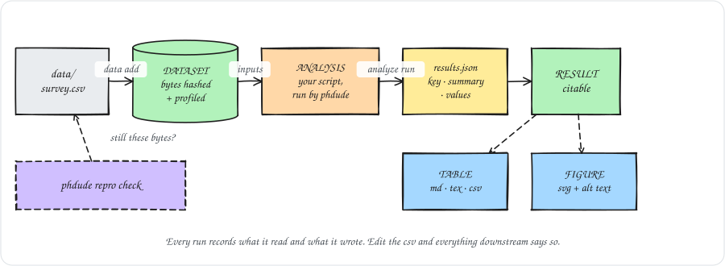
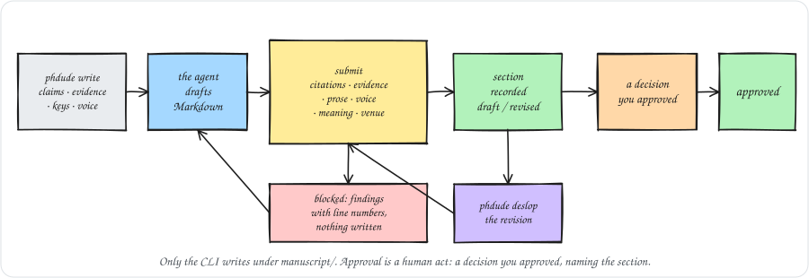

<div align="center">


# PhDude

**The senior researcher in your terminal.**

Your AI can write. PhDude helps make the research worth publishing.

[](https://github.com/LucioY250/phdude/actions/workflows/ci.yml)
[](CHANGELOG.md)
[](package.json)
[](LICENSE)
[](#set-up-your-agent)

</div>

---

Coding agents are already good at the individual tasks of research: find a paper, summarize
it, draft a section, run a regression. What they are bad at is the *project*. They forget what
you decided last month, they state a shaky claim as fact because it reads well, and they have
no idea that the sample size in your thesis draft disagrees with the one in your defense slides.

PhDude is the part that remembers. It is a free, open-source harness that wraps Claude Code,
Codex or any agent that reads `AGENTS.md` in a persistent, evidence-aware research workspace,
so the agent behaves like a senior colleague who has actually read your project:

- **it knows what you are trying to establish**, what evidence exists, and what is missing;
- **it will not let a claim outrun its evidence**: every claim carries an explicit knowledge
  state, and nothing becomes "canonical" without a decision you approved;
- **it notices contradictions** between your own documents before a reviewer does;
- **it always has an answer to "what should we do next?"**, with the reasons attached.

It makes no assumptions about your field. A clinical trial, an archival history and an
empirical software-engineering paper get the same treatment; discipline-specific vocabulary
and review questions arrive as packs.

> **Where things stand.** This is v0.6. The deterministic core is done and tested: workspace,
> ingestion, the knowledge graph, decisions, conflict detection, packs, `status` and `next`, the
> citation registry, the literature matrix and gap report, workspace migrations, five literature
> search providers, and the Claude Code and Codex adapters. v0.4 taught PhDude to help *write*:
> a manuscript with per-section status, a bounded writing context, six deterministic gates every
> draft goes through, and a prose report that shows its arithmetic. v0.5 taught it to run the
> *analysis* — datasets, scripts under an execution policy, results with lineage, tables and
> figures. New in this release, it produces the *documents*: DOCX, PDF, LaTeX, HTML, slides and
> spreadsheets, built from the approved sections against the venue you are writing for. The
> reviewer skills come next; see the [roadmap](#roadmap).

## What's new in 0.6

v0.6 is the Document Factory. Until now the manuscript lived in `manuscript/` as a set of
Markdown files and a YAML plan. Now it comes out the other end as the file you have to send
somebody — and it comes out the same way twice.

- **`phdude build`.** One command turns the approved sections into `outputs/<slug>/manuscript.md`,
  `.docx`, `.tex`, `.html` or `.pdf`, in the order the venue puts them, under the headings the
  venue calls them, with `references.bib` regenerated from the citation registry and the figures
  the prose shows copied in beside the document. Markdown is built in and needs nothing installed.
  Everything else goes through Pandoc, and PDF through a TeX engine; when one is missing the
  command exits 4 and names the package, and never quietly produces a different format instead.
- **Builds that skip themselves.** Every input is hashed — each section body, the bibliography,
  each figure and table, the venue profile, the template, and the renderer's own version. A build
  whose inputs all match the last one, and whose output file is still the one that build wrote,
  reports `up to date`, renders nothing and records nothing. Running it twice is the cheap way to
  ask whether the DOCX on disk is current.
- **The same bytes tomorrow.** A build never reads the clock: the date on the title page comes
  from `manuscript.yaml` or from the approval the workspace recorded. Identical inputs and an
  identical Pandoc produce identical Markdown, LaTeX and HTML. DOCX and PDF are containers with
  timestamps inside, so those are best-effort, and
  [ADR 10](docs/adr/0010-renderer-adapters-and-reproducible-builds.md) says exactly how far the
  promise goes.
- **Venue packs.** `generic-thesis`, `ieee` and `acm` ship as packs, each carrying the sections
  the venue expects, its word limits, its CSL citation style (vendored, licence intact) and a
  minimal LaTeX template for its document class. `phdude profile check` reports the manuscript
  against one: a required section that is missing, an abstract over the limit, two sections in the
  wrong order, a figure in a format the venue does not take. It exits 2 while anything blocks.
- **`phdude adapt --to <venue>`.** What moving the work would cost, before anything is changed:
  which section becomes which, how many words each one is over, which figures need converting,
  which words the venue renames, and which citation style takes over. `--apply` writes a second
  manuscript for that venue, marking the sections that no longer fit as `revised`. It never
  rewrites a line of prose — that goes back through `phdude deslop` and the gates, like every
  other revision.
- **Slides and spreadsheets.** `phdude present outline` writes the talk from the research: one
  slide per approved section, or per claim the evidence supports, with its strongest excerpts as
  bullets, and a PPTX too when Pandoc is installed. `phdude table build --format xlsx` writes a
  real spreadsheet with numbers typed as numbers, using no external tool at all.
- **A templates registry.** `phdude template add <path>` files your university's DOCX or your
  conference's LaTeX template under `templates/`, `template use <name> --for <venue>` binds it to
  a venue, and `template check` unzips a DOCX to say whether it actually declares the styles
  Pandoc writes with. A template you registered outranks the one the venue pack ships.
- **Migration 0003** brings an older workspace to version 4: an empty `venues` list in
  `phdude.yaml` and an empty template registry under `.phdude/`.

### What 0.5 added: analysis with lineage

- **Datasets and analyses.** `phdude data add` makes a file's bytes its identity and profiles its
  columns; `phdude analyze run` runs a script with an argument array, no shell and a timeout, and
  records the hash of every input and output. Execution is closed by default.
- **Results you can cite.** Each entry in a script's `results.json` becomes a `RESULT` pointing
  back at the analysis that produced it, so a number in the thesis has a chain behind it.
- **Tables and figures as objects.** `phdude table build` renders a result or a dataset
  deterministically; `phdude figure build` runs a generator through the same execution policy, and
  a figure without alt text never becomes a record at all.
- **`phdude repro check`.** One line per analysis, table and figure, saying whether what is on
  disk still follows from what is recorded, and naming the input that moved.

See [why there is no detector score](#the-one-number-phdude-will-not-give-you).

## Contents

- [What's new in 0.6](#whats-new-in-06)
- [How it works](#how-it-works)
- [Install](#install)
- [Set up your agent](#set-up-your-agent) (Claude Code, Codex, anything else)
- [A first session](#a-first-session)
- [Finding literature](#finding-literature)
- [Analysis and figures](#analysis-and-figures)
- [Writing with PhDude](#writing-with-phdude)
- [Building documents](#building-documents)
- [What's in the box](#whats-in-the-box)
- [Your workspace](#your-workspace)
- [Commands](#commands)
- [Packs](#packs)
- [Principles](#principles)
- [Roadmap](#roadmap)
- [Contributing](#contributing)

## How it works

The agent thinks. The harness remembers, validates, and refuses.

<p align="center"></p>

The agent never edits research state by hand. It goes through the CLI, so every change is
schema-validated, attributed to a researcher and an agent, and appended to an audit log. Four
kinds of parts make this up:

<p align="center"></p>

### Where the knowledge comes from

Drop documents in `sources/` and run `phdude ingest`. Nothing here involves a model: it is
hashing, parsing and bookkeeping, and it is idempotent.

<p align="center"></p>

The agent then reads the cached text section by section, never whole documents, and turns it
into research objects through `phdude add`: sources, facts with their locators, evidence, and
candidate claims. Everything it adds points back to where it came from:

<p align="center"></p>

`phdude knowledge trace CLAIM-…` walks this graph in both directions, so "where did this number
come from?" has an answer.

### How a claim earns the right to be stated plainly

<p align="center"></p>

The transition into `canonical` is the only one the CLI gates, and it gates it hard: without an
approved decision that lists the object, `phdude promote` exits with code 3. An agent cannot
talk its way around it, and neither can a tired researcher at 2 a.m.

### How "what next?" is decided

<p align="center"></p>

Every rule is deterministic and every recommendation carries its reasons, its impact, and the
command that does it. There is no hidden score.

## Install

v0.5 is not on npm yet. Install it from the repository:

```
git clone https://github.com/LucioY250/phdude && cd phdude
npm ci
npm link
phdude --version      # phdude 0.5.0
```

Node 22 or newer. `pdftotext` (poppler-utils) is optional: without it PDFs are still
inventoried and hashed, and `phdude doctor` tells you exactly what is missing.

```
sudo apt install poppler-utils     # Debian / Ubuntu
brew install poppler               # macOS
```

## Set up your agent

`phdude init` creates the workspace and writes the files each agent host needs. The research
state is identical whichever agent you use, and two people on two different agents can share
one repository.

### Claude Code

```
mkdir my-research && cd my-research
phdude init --title "Adaptive scheduling in edge clusters" --agents claude-code
```

This writes:

| File | Purpose |
|---|---|
| `CLAUDE.md` | Entry point. Imports `AGENTS.md` and adds Claude-specific notes. |
| `AGENTS.md` | Operating rules, the command reference, and an *index* of skills. Skills are loaded on demand, not up front, to keep your context small. |
| `.claude/commands/phdude*.md` | Slash commands, one per CLI command: `/phdude` (the dispatcher), `/phdude-init`, `/phdude-bootstrap`, `/phdude-ingest`, `/phdude-status`, `/phdude-next`, `/phdude-knowledge`, `/phdude-add`, `/phdude-link`, `/phdude-decide`, `/phdude-promote`, `/phdude-cite`, `/phdude-audit`, `/phdude-research`, `/phdude-research-fresh`, `/phdude-freshness`, `/phdude-edit`, `/phdude-matrix`, `/phdude-gaps`, `/phdude-health`, `/phdude-review`, `/phdude-data`, `/phdude-analyze`, `/phdude-table`, `/phdude-present`, `/phdude-template`, `/phdude-figure`, `/phdude-repro`, `/phdude-authors`, `/phdude-write`, `/phdude-deslop`, `/phdude-manuscript`, `/phdude-prose`, `/phdude-packs`, `/phdude-profile`, `/phdude-build`, `/phdude-adapt`, `/phdude-skills`, `/phdude-mode`, `/phdude-migrate`, `/phdude-doctor`, `/phdude-help`. |
| `.phdude/skills/*/SKILL.md` | The skills themselves, in the open `SKILL.md` convention. |

Open Claude Code in the directory and start with:

```
/phdude bootstrap
```

`/phdude` on its own reports status and the top next action. `/phdude ruthless` (or `lite`,
`full`, `off`) sets how hard the agent pushes back. Every slash command runs the CLI with
`--json` and follows the matching skill; the commands are allow-listed to `phdude` only.

### Codex

```
mkdir my-research && cd my-research
phdude init --title "Adaptive scheduling in edge clusters" --agents codex
```

Codex has no slash commands and no on-demand skill loading, so it gets one file:

| File | Purpose |
|---|---|
| `AGENTS.md` | Operating rules, the command reference, and every skill inlined in full. Codex reads it at the start of each session. |

Open Codex in the directory and ask it to bootstrap the research workspace. It will run
`phdude bootstrap --json`, follow the bootstrap skill, and report what the project is, what is
known, what conflicts, and what to do next. From then on ask it for status, the next action, or
any `phdude` command by name.

### Both, or another agent

```
phdude init --title "…" --agents claude-code,codex
```

is the default, and gives you both sets of files; the compact skills index wins for `AGENTS.md`, since Claude Code
loads skills on demand and Codex still finds them by path. Any other agent that reads
`AGENTS.md` (OpenCode, Gemini CLI, and most others) works the same way as Codex. If yours reads
nothing by default, point it at `.phdude/skills/phdude-core/SKILL.md` and it has the rules.

`init` never overwrites a `CLAUDE.md` or `AGENTS.md` you wrote yourself; it only manages files
that carry its own marker, and it tells you which ones it skipped.

## A first session

```
cp ~/Downloads/*.pdf ~/Downloads/*.docx sources/
```

Then `/phdude bootstrap` (Claude Code) or `phdude bootstrap` (Codex, or you). PhDude
inventories and hashes every file, extracts and caches the text, and hands the agent a plan:
classify the artifacts, pull out sources, facts and candidate claims, propose research
questions for you to confirm. From then on you talk to your project:

```
phdude status     # what the project is, what is known, what conflicts
phdude next       # the highest-impact next action, and why
```

`phdude next` never just tells you what to do. It shows its work:

```
Highest-impact next action:

Resolve the conflicting value(s) for "sample_size"

Why:
- sample_size: 312 participants (ART-35146e2f6d, ART-0772a215de) vs 300 participants (ART-f7ced78004)
- 3 claim(s) depend on the conflicting artifacts

Expected impact:
HIGH

Command:
phdude decide propose --title "Resolve sample_size" --rationale "…" --affects FACT-2bc4462edb FACT-54af7fa906 FACT-f62e1a2f34 --change '{"fact_key":"sample_size","canonical_value":…}'

Other candidates:
1. (medium) Review the research gaps report
2. (medium) Classify artifacts with unknown role
3. (medium) Refresh the literature behind the research questions
4. (medium) Approve or reject pending decisions
5. (medium) Close the evidence gap for unaddressed research questions
6. (low) 15 open gap(s); run phdude gaps
```

That block is the real output of `phdude next` on the [example workspace](examples/generic-thesis)
that ships with the repository. The workspace was generated by a script from the same CLI you
will use; nothing in it is hand-written.

When the agent proposes a decision, you approve it by name, and only then can the object it
names become canonical:

```
phdude decide approve DEC-… --by lucio
phdude promote CLAIM-… --decision DEC-…
```

## Finding literature

By default PhDude never touches the network. Turning that on is a two-line edit to
`.phdude/research-policy.yaml`, which is also where you say who you want searched and what
counts as a paper worth returning:

```yaml
network:
  enabled: true              # nothing leaves the machine until this is true

skills:
  allow_network: true        # installs the research skill your agent follows

providers: [openalex, crossref, arxiv]   # also available: semantic-scholar, pubmed

research:
  year_range: { from: 2021 }
  languages: [en, es]
  peer_reviewed: preferred   # preferred | required | any
  preprints: { require_approval: true }
  freshness: { stale_after_days: 180 }
  limit: 20                  # per provider, not a total
```

`skills.allow_network` is a separate switch on purpose: it is what lets `phdude init` install
the `research` skill, which is the one skill that touches the network. Run `phdude init` again
after you set it, and the skill lands in `.phdude/skills/research/`.

Then ask a question of the literature, tied to one of your research questions:

```
phdude research "note-taking app adoption undergraduates" --question RQ-1
```

Every provider in the list gets the same query. What comes back is deduplicated into one
candidate per paper — same DOI, or same title and year — merged so a field one provider left
empty is filled by one that reported it, and ranked by a score that is written down rather than
hidden (`score_parts` explains it in `--json`). None of it is knowledge yet:

```
phdude research list --state candidate
phdude research show CAND-…
phdude research accept CAND-… --type article
phdude research dismiss CAND-… --reason "measures a different construct"
```

`accept` is the only path from a search result into your citation registry. It creates the
`SRC-` record with whatever identifiers the providers actually reported, notes where it came
from, and invents nothing — run `phdude cite check` afterwards and it will tell you what is
still missing. A preprint needs `--approve-preprint` on top, because
`preprints.require_approval` says a preprint is your call, not the tool's.

Literature ages whether or not anyone looks at it:

```
phdude freshness                   # last search per question, age per source, what is stale
phdude research-fresh --question RQ-1
```

`research-fresh` re-runs a stale search exactly as it ran the first time and tells you only what
is new.

### What actually leaves your machine

A provider call carries exactly this, and nothing else:

- **the query string** — what you or your agent typed, verbatim;
- **the result limit and the `from` year** (`research.limit` and `research.year_range.from`, or
  `--limit` and `--from`), sent as that provider's own filter parameters;
- **a `phdude/<version>` User-Agent**, so an API owner can see who is asking;
- **your `email` from `.phdude/author-profile.yaml`**, as the polite `mailto` that OpenAlex and
  Crossref ask for — only to those two, and only if you filled one in;
- **`PHDUDE_S2_API_KEY`**, as an `x-api-key` header, only to Semantic Scholar, only if it is set;
- **`PHDUDE_NCBI_API_KEY`**, as the `api_key` query parameter NCBI documents, only to PubMed,
  only if it is set.

Nothing from your workspace goes with it: no document, no excerpt, no filename, no path, no
title of anything you ingested. Both API keys are read from your environment and never from the
workspace, and neither one reaches an error message or the event log. Every call appends one
line to `.phdude/events.jsonl` naming the provider, the query and how many results came back — a
failed call included, because the query left the machine either way:

```json
{"ts":"…","op":"search","actor":{…},"ids":["SEARCH-7c2d4e6a10"],"summary":"openalex: \"open science practices\" → 3 results"}
```

`phdude doctor` prints the policy and the configured providers without calling anything.

Your agent is held to the same rule: the core skill forbids it from fetching a paper, an
abstract or a DOI on its own, by any means. If the policy is closed, it reports that and asks
you — it does not pass `--allow-network` on your behalf.

## Analysis and figures

A number in a thesis has to come from somewhere you can point at. PhDude does not do statistics —
your script does, in whatever language you already use — but it holds on to which file the script
read, which bytes that file had, what the script reported, and which table and figure were drawn
from it.

<p align="center"></p>

Start by registering the data:

```
phdude data add data/survey.csv
```

The file's bytes are its identity, so the id is `DATASET-<hash>`: re-adding the same file does
nothing, and editing it and adding it again makes a second dataset linked to the first. The
record carries a profile you can read — rows, each column's inferred type, how many cells are
missing, how many distinct values it holds. Set `"sensitive": true` and the profile keeps the
counts and drops the values.

Then declare what reads it:

```
phdude analyze add --json '{"name":"survey descriptives","runtime":"node",
  "script":"analysis/describe.mjs","inputs":["DATASET-bc43bf3439"]}'
phdude analyze run ANALYSIS-a5b945f2cd --allow-exec
```

The script is yours and it stays yours. PhDude runs it with an argument array and no shell, with
the workspace as the working directory and an environment holding almost nothing —
`PHDUDE_WORKSPACE`, `PHDUDE_ANALYSIS`, `PATH`, `HOME`, `LANG` — and it does not run at all unless
`execution.enabled: true` is in your research policy or you pass `--allow-exec`. **A fresh
workspace has execution closed.** Nothing in PhDude will open it for you, and your agent is
forbidden from running the script another way.

What the script owes back is one JSON file:

```json
{ "results": [ { "key": "daily_use_by_channel",
                 "summary": "Daily use is lowest in the social-media sample.",
                 "values": { "mailing list": 0.75, "campus social media": 0.5 },
                 "unit": "proportion" } ] }
```

Each entry becomes a `RESULT` you can cite like any other knowledge, with `from` pointing back at
the analysis. Run it again with the same numbers and nothing happens. Run it again and get a
different *sentence* for a key, and the old result is marked superseded rather than overwritten,
so the version of the finding your draft quoted is still there. Run it again and get different
*numbers* under the same sentence, and that record is corrected in place: a result's id comes
from its summary and its analysis, so it has no second id to supersede itself with. Put the
number in the summary — `"Mean respondent age is 38.4 years"`, not `"Mean age"` — when you want
the old one kept. The run itself is recorded with the hash of every input it read and every file
it wrote.

A result becomes a table, and a table is three files:

```
phdude table add --json '{"name":"daily-use-by-channel","caption":"Daily use by channel.",
  "source":{"result":"RESULT-d09b2158fb"},
  "columns":[{"key":"key","label":"Recruitment channel"},
             {"key":"value","label":"Daily use","format":"percent:0"}]}'
phdude table build TABLE-49db8343a8
```

Markdown, LaTeX (`booktabs`, with a `\label`) and CSV under `tables/out/`, rendered
deterministically and escaped properly, so the same result gives you the same bytes every time.

A figure is drawn by a generator, and it needs alt text before it exists:

```
phdude figure add --json '{"name":"respondents-by-channel","caption":"Respondents by channel.",
  "alt":"Bar chart: the mailing list contributed 8 of the 20 respondents…",
  "generator":{"runtime":"node","script":"phdude:bar-chart","args":["--input","…","--key","…"]},
  "inputs":["RESULT-8189aa9910"],
  "outputs":[{"path":"figures/out/respondents-by-channel.svg","format":"svg"}]}'
phdude figure build FIG-843c619df9 --allow-exec
```

`alt` is required and cannot be empty. A figure without a sentence saying what it shows is not a
figure a thesis can publish, and the moment to write that sentence is while you still remember
the finding. `phdude:bar-chart` is the one generator that ships with PhDude — plain Node, no
dependencies, an accessible SVG with a title, a description, real axis labels and one colour that
survives being printed in grayscale. Point `script` at something under `figures/` and PhDude runs
yours instead.

Then the question all of this exists to answer:

```
$ phdude repro check
ANALYSIS-a5b945f2cd  survey descriptives     up-to-date
TABLE-49db8343a8     daily-use-by-channel    up-to-date
FIG-843c619df9       respondents-by-channel  up-to-date

3 item(s): 3 up-to-date
```

Edit `data/survey.csv` and run it again, and all three say `stale`: the analysis because
`input DATASET-bc43bf3439 bytes changed on disk`, the table and the figure because the result
they draw comes from an analysis that is itself stale. Nothing was watching the file; the check
simply re-hashes it. `phdude repro check` always exits 0. It is a report, not a gate: it tells
you the numbers in your manuscript no longer follow from the data under them, and what to do
about that is yours to decide.

Until the file is registered again, `phdude analyze run` refuses it rather than recording a hash
for bytes it never read. `phdude next` prints the three commands that clear it: register the
file, re-declare the analysis against the new `DATASET` id, re-run.

`phdude status` counts the same things in its `Analysis:` block, `phdude next` raises a stale
analysis to high impact once a supported or canonical claim rests on one of its results, and
`phdude gaps` reports a result nothing has cited yet.

## Writing with PhDude

PhDude does not write your prose. Your agent does, and it is good at it. What PhDude adds is
everything around the draft: what the agent is allowed to know while writing, and what the text
has to survive before it becomes a section of your manuscript.

<p align="center"></p>

Start by planning the document:

```
phdude manuscript init --title "Adaptive scheduling in edge clusters" --voice lucio
phdude manuscript status
```

That writes `manuscript/manuscript.yaml` with the six standard sections — abstract,
introduction, methods, results, discussion, conclusions — all `planned`. Nothing else exists
yet; a section file appears the first time a draft gets past the gates.

### The writing context

```
phdude write introduction
```

This is the step that decides what the draft can say. It gathers the section's claims with
their state and their strongest evidence (excerpt and locator included), the citation keys that
actually resolve, your writing policy, the active voice profile, and the verb table for each
claim's state — in that priority order, stopping at a character budget and telling you what it
left out. The context lands in `.phdude/cache/writing/introduction/context.md`, and the command
prints the contract the draft has to meet: this section only, `[@bibkey]` for citations,
`<!-- claim: CLAIM-… -->` on every paragraph that asserts one, `<!-- fact: FACT-… -->` on every
number that came from your data, no source or finding the context did not carry.

`phdude write` never writes prose. It writes cache, and it records no event.

### Submitting through the gates

The agent drafts to a file and submits it:

```
phdude manuscript submit introduction --file draft.md
```

Six gates are registered. Five run on a first draft, and `gate-meaning` joins them on a
revision, because it needs something to compare against:

| Gate | Blocks when |
|---|---|
| `gate-citations` | a `[@key]` resolves to no source, or cites a candidate you dismissed |
| `gate-evidence` | a marker names nothing, a rejected claim is asserted, or a verb outruns the claim's state |
| `gate-prose` | never in `full` mode — it reports and scores; in `ruthless` mode every warning blocks |
| `gate-voice` | never — it reports how far the draft sits from the active voice profile |
| `gate-meaning` | a revision drops a claim, a citation, a number or a negation |
| `gate-profile` | a section runs past its venue profile's word limit |

A block writes nothing at all — not the section, not the report, not an event. You get the
findings with line numbers and exit code 2, and the workspace is exactly where it was:

```
  - gate-citations:6 [@nobody2020] does not resolve to a recorded source
  - gate-meaning:1 the revision drops 1 negation(s) the section carried
section blocked by gate-citations, gate-meaning: 3 finding(s)
```

A clean submit writes the section file with its hash, updates the manuscript entry to `draft`,
stores the gate report in `manuscript/reports/introduction.yaml`, and appends one event.

### Revising without losing the argument

```
phdude deslop introduction                      # what to change, and what not to
phdude deslop introduction --file revised.md    # the revision, through every gate
```

Without a file, `deslop` prints the section's prose observations and the revision contract: the
sentences to rewrite, and the explicit list of what a rewrite may not touch. With a file, it
runs the gates again with meaning preservation on. That last gate is the one that matters. It
extracts from the old text and the new one the multiset of claim ids, citation keys and
numerals, counts the negations each carries, and refuses a revision that lost any of them.
Rewording a negated sentence is fine, and so is swapping "did not" for "failed to"; dropping the
negation altogether reverses the finding, and PhDude will not let a cleanup pass do that
quietly.

### The prose report

```
phdude prose introduction
```

```
Academic Prose Quality: 91/100

Specificity             70
Evidence Alignment      100
Epistemic Precision     100
Structural Variation    100
Author Voice            n/a (needs manuscript context)
Conciseness             80

Observations (3):

WARN (3):
  - 5: It is important to note that the literature suggests adoption of these tools is significa…
    empty-phrase: filler that can be deleted without losing meaning: "it is important to note"
    Hint: delete the phrase and keep the sentence
```

Six sub-scores, each one arithmetic over counts you can check, with the formula written down in
[docs/cli.md](docs/cli.md) and the located observations behind it. `phdude prose --file <path>`
runs the same report over any text file and needs no workspace at all.

A section is hashed when it is submitted, and that hash is checked. Edit a section file in your
editor and `phdude manuscript show`, `phdude prose` and `phdude doctor` all tell you the same
thing — `section introduction was edited outside PhDude since its last submit` — until the text
goes back through the gates.

### Approval is yours

A section becomes `approved` the same way a claim becomes canonical: through a decision you
approved by name.

```
phdude decide propose --title "Approve the revised introduction" \
  --rationale "…" --affects manuscript:introduction
phdude decide approve DEC-419673dd70 --by lucio
phdude manuscript approve introduction --decision DEC-419673dd70
```

A decision that nobody approved, or one that does not name the section, is refused with exit 3.
An approved section is not overwritten either: a later submit is refused until you run
`phdude manuscript reopen`, which records the withdrawal of the approval rather than quietly
discarding it.

### Your voice, as numbers you can read

```
phdude authors add --json '{
  "id": "lucio",
  "language": "en",
  "tone": { "academic": true, "assertiveness": "moderate", "first_person": "sparing" },
  "sentences": { "length": "varied", "openings": "varied" },
  "paragraphs": { "density": "medium" },
  "transitions": "minimal",
  "terminology": { "preserve": ["placement policy"], "avoid": ["leverage", "robust"] }
}'
phdude authors learn lucio --from papers/2024-thesis-ch3.md --approved
phdude authors show lucio
```

`learn` reads writing you have approved and computes descriptive statistics from it: mean
sentence length and its spread, opening diversity, paragraph density, transition rate, first-person
rate, hedge rate, and the terminology you keep using. They land under `learned:` in
`authors/lucio.yaml` as plain numbers and word lists. You can read every one of them, disagree
with one, and edit it. There is no embedding anywhere in the file, which is the point: a voice
profile you cannot inspect is a voice profile you cannot correct.

On a project with several authors, `phdude authors consensus` merges the profiles — median for
the numbers, union of what everyone preserves, intersection of what everyone avoids — into
`authors/project-consensus.yaml`, and proposes a decision when the merge changes.

### The one number PhDude will not give you

PhDude does not compute an AI-detector score, does not estimate one, and does not optimize for
one. Any option that looks like it is asking for one — `--detector`, `--humanize-to`,
`--ai-detection-score` — exits 3 on every command, including commands that do not exist.

This is a deliberate refusal, not a missing feature. Detector scores are unreliable, they are
biased against people writing in a second language, and optimizing for one teaches a tool to
disguise text rather than improve it. The failure mode is precise: a section that scores well
on a detector and still asserts a claim the evidence does not support is worse than the honest
draft it replaced, because it now reads as though someone checked.

So the prose report measures things that are true or false about your text — a citation that
resolves, a claim whose evidence is all weak, a number with no source, a paragraph of filler —
and each one comes with the line it is on and the arithmetic behind it. Fix those and the writing
gets better for readers, which happens to be the only audience that matters.

## Building documents

Approved sections are not a document. Somebody wants a DOCX by Friday, the conference wants
LaTeX in its own class, and your supervisor wants to read it on a train. `phdude build` makes
those files, and makes them the same way every time.

```
phdude build
```

That is the whole command. It takes the sections you have approved, puts them in the order the
venue asks for under the headings the venue uses, regenerates `references.bib` from the citation
registry, copies in the figures the prose shows, and writes the lot into `outputs/<slug>/`:

```
outputs/note-taking-adoption/
├── manuscript.md
├── references.bib
└── figures/
    └── adoption.svg
```

Markdown is built in and always works — no Pandoc, no LaTeX, nothing to install. Every other
format goes through Pandoc, and PDF through a TeX engine as well:

```
phdude build --format docx
phdude build --format latex --profile ieee
phdude build --format pdf
```

When the tool is not there, the command exits 4 and tells you what to install. It never falls
back to a different format under the name of the one you asked for, because a `.docx` that is
secretly Markdown is worse than no file at all. `phdude doctor` lists what this machine has.

### Run it twice and nothing happens

```
$ phdude build --format docx
Built outputs/note-taking-adoption/manuscript.docx

$ phdude build --format docx
The build is up to date. Build it anyway with --force.
```

Everything the document depends on is hashed into `.phdude/cache/build/`: each section body, the
bibliography, each figure and table, the venue profile, the template, and Pandoc's own version.
If none of them moved and the file on disk is still the one the last build wrote, there is
nothing to do — so `phdude build` is also the answer to "is the DOCX I sent still the current
one?". When something did move, `--json` names it, right down to `renderer` when the only thing
that changed was a Pandoc upgrade.

The same discipline makes builds reproducible. A build never reads the clock: the date on the
title page comes from `manuscript.yaml`, or from the approval the workspace recorded. Identical
inputs and an identical Pandoc give identical Markdown, LaTeX and HTML, byte for byte. DOCX and
PDF are zip containers with timestamps inside them, so those are best-effort and
[ADR 10](docs/adr/0010-renderer-adapters-and-reproducible-builds.md) says exactly how far the
promise goes.

### The venue is a pack

Three venues ship with PhDude — `generic-thesis`, `ieee` and `acm` — and each is a small
directory: the sections it expects with their word limits, its CSL citation style vendored with
its licence intact, and a minimal LaTeX template for its document class.

```
phdude packs apply ieee        # this project is aiming at IEEE
phdude profile use ieee        # this manuscript targets it
phdude profile check
```

`check` is the report you read before you send anything:

```
ieee (IEEE conference paper)
  block abstract: 312 words exceeds the 250-word limit ieee sets for abstract
        cut the section, raise the limit in the venue profile, or drop target_profile
  warn  ieee does not list a "appendix" section
  info  references follow IEEE

1 block, 1 warn, 1 info
```

It exits 2 while anything blocks, and it never fixes anything itself. Cutting the abstract is
your call, and raising the limit in the venue profile so the prose fits is not a fix — the venue
is not negotiating.

Writing your own venue is a `pack.yaml` and a `profile.yaml`; a workspace venue under
`.phdude/packs/venues/` overrides a shipped one of the same name. See
[docs/extending.md](docs/extending.md).

### Moving to another venue

A thesis chapter is not an eight-page conference paper, and pretending otherwise is how a
submission gets desk-rejected. `phdude adapt` says what the move would cost before anything
changes:

```
$ phdude adapt --to ieee
generic-thesis → ieee

Sections
  abstract      → abstract      abstract is the same section id
  introduction  → introduction  introduction is the same section id
  methods       → methods       methods is the same section id
  results       → results       results is the same section id
  discussion    → discussion    discussion is the same section id
  appendix      → —             needs decision: ieee lists no section for appendix

Word limits
  introduction  1840 / 1200 words  640 over

Abstract
  312 / 250 words (was 500)  62 over

Terminology
  Figure → Fig.  (4 in the prose)

Citation style: APA 7th edition → IEEE

Nothing was written. --apply writes manuscript/manuscript.ieee.yaml.
```

Sections map by id, then by a synonym the venue declares, then by a shared title. What nothing
matches is reported as **needs decision** and left alone: what an appendix becomes at a venue
that has no appendices is a decision about your argument, not a string-matching problem.

`--apply` writes a second manuscript for that venue — the same section files under IEEE's ids,
titles and order — and marks everything over a limit as `revised`. It does not touch
`manuscript/manuscript.yaml`, and it does not touch a single word of your prose. Cutting 640
words out of an introduction is a writing job, and it goes back through `phdude deslop` and the
same gates as everything else, which is what stops "shorter" from turning into "one claim
lighter".

### Slides, spreadsheets and templates

The talk comes from the same research the paper does:

```
phdude present outline
phdude present outline --from claims
```

One slide per approved section, or per claim the evidence supports with its strongest excerpts
as bullets, written to `outputs/<slug>/outline.md` — and to `outline.pptx` when Pandoc is
installed. `phdude table build --format xlsx` writes a real spreadsheet, numbers typed as
numbers, with no external tool involved at all.

If your university hands out a DOCX template, register it once:

```
phdude template add ~/Downloads/thesis-template.docx --kind docx
phdude template use thesis-template --for generic-thesis
phdude template check thesis-template
```

`check` unzips the file and reports whether it actually declares the styles Pandoc writes with —
Heading 1 to 3, Body Text, Caption — which is the difference between a build that comes out
looking like your department's thesis and one that comes out looking like Pandoc's default.
A template you registered outranks the one the venue pack ships.

### Nothing under `outputs/` is yours to edit

It is derived, it is gitignored, and the next build overwrites it. A typo you fix in
`outputs/…/manuscript.docx` is a typo that comes back, and now the workspace and the file you
sent say different things. Fix the prose with `phdude deslop <section> --file`, the reference
with `phdude edit` on the source, the figure with `phdude figure build` — then build again.

## What's in the box

```
phdude/
├── bin/phdude.js          the CLI entry point
├── src/
│   ├── domain/            pure logic: ids, hashing, lineage, conflicts, gaps, candidates, rules
│   ├── application/       use cases: init, ingest, add, link, decide, cite, research, edit, …
│   ├── ports/             the contracts adapters implement (+ their contract test suites)
│   ├── adapters/          filesystem store, document parsers, git, search providers, agent hosts, CLI
│   └── schemas/           the JSON Schema validator
├── schemas/               one JSON Schema per research object, plus the skill contract
├── migrations/            one module per workspace-version step
├── skills/                the fourteen core skills, one SKILL.md directory each
├── generators/            the figure generators PhDude ships (bar-chart.mjs, plain Node)
├── commands/              the Claude Code slash-command templates
├── packs/                 ten starter packs: fields/, methods/ and venues/
├── defaults/              the research constitution and policies a new workspace gets
├── examples/              a complete generated workspace, used by the golden tests
├── docs/                  CLI reference, workspace guide, extending guide, ADRs
└── tests/                 unit · contract · integration · golden · e2e (node:test only)
```

Three runtime dependencies (`yaml`, `ajv`, `fflate`). The only code that can reach the network
is a search provider under `src/adapters/search/`, and only `phdude research` and
`phdude research-fresh` can call one — under the policy above. The domain layer cannot import
the filesystem, and a test makes sure it never does.

## Your workspace

```
my-research/
├── phdude.yaml          # project: title, fields, methods, outputs, mode, workspace_version
├── AGENTS.md            # shared agent instructions
├── CLAUDE.md            # Claude Code entry point
├── .claude/commands/    # slash commands (Claude Code)
├── .phdude/
│   ├── constitution.yaml, research-policy.yaml, writing-policy.yaml, …
│   ├── skills/          # installed skills
│   ├── events.jsonl     # append-only audit log
│   └── cache/           # extracted text, gitignored, rebuildable
├── sources/             # the raw materials you drop in
├── authors/             # voice profiles, learned from approved samples
├── knowledge/
│   ├── artifacts/       # ART-*.yaml   one per unique file
│   ├── sources/         # SRC-*.yaml   bibliographic sources
│   ├── claims/          # CLAIM-*.yaml
│   ├── evidence/        # EVID-*.yaml
│   ├── facts/           # FACT-*.yaml  project facts with their origin
│   ├── results/         # RESULT-*.yaml  findings, from an analysis or recorded by hand
│   ├── datasets/        # DATASET-*.yaml  a file under data/, hashed and profiled
│   └── candidates/      # CAND-*.yaml  literature hits awaiting your verdict, not yet sources
├── research/            # questions/ RQ-*.yaml · hypotheses/ H-*.yaml · methods/ METH-*.yaml
│                        # searches/  SEARCH-*.yaml  what was asked, of whom, and when
├── decisions/           # DEC-*.yaml
├── manuscript/          # manuscript.yaml, one .md per section, reports/ per section
│                        # manuscript.<venue>.yaml is what `phdude adapt --apply` writes
├── references.bib       # written by `phdude cite export`; derived, not knowledge
├── data/                # your data files; the ones you register become DATASET records
├── analysis/            # ANALYSIS-*.yaml and your scripts · out/ holds what they write
├── tables/              # TABLE-*.yaml · out/ holds the rendered md, tex and csv
├── figures/             # FIG-*.yaml and your generators · out/ holds the drawn files
├── templates/           # your DOCX, PPTX and LaTeX templates, filed by kind
└── outputs/<slug>/      # what `phdude build` and `phdude present outline` deliver
```

Every `out/` directory is gitignored: what is in it is reproducible from the record beside it,
and the record already carries the hash of what the run wrote.

One object per file, content-derived ids, schema on every file. Plain YAML and Markdown under
git: you can read, diff, review and merge all of it without PhDude installed, and if you stop
using it you keep a folder, not a database dump. Details in [docs/workspace.md](docs/workspace.md).

## Commands

| Command | What it does |
|---|---|
| `phdude init [dir]` | Create a workspace. Safe to run again. |
| `phdude bootstrap` | Ingest, detect packs, report status and next, hand off to the agent. |
| `phdude ingest [paths…]` | Inventory, hash, extract and cache source documents. |
| `phdude status` | Project, inventory, knowledge counts, conflicts, pending decisions. |
| `phdude next` | The highest-impact next action, with reasons and the exact command. |
| `phdude knowledge list\|show\|trace` | Query the knowledge graph and follow its lineage. |
| `phdude add <type>` | Add a claim, evidence, fact, source, question, hypothesis, method or result; set an artifact's role with `add artifact-role`. |
| `phdude link <id> --to <ids…>` | Attach evidence to a claim, a claim or method to a question, an artifact to a source. |
| `phdude decide propose\|approve\|reject\|supersede` | Research decisions. The agent proposes; the researcher decides. |
| `phdude promote <id> --decision <DEC-id>` | Make an object canonical, with an approved decision behind it. |
| `phdude cite list\|check\|export` | Citation registry: list sources, verify them, export BibTeX/CSL-JSON. |
| `phdude audit citations [--allow-network]` | Audit the citations: keys that resolve to nothing, claims with no recorded source behind them, cited sources nobody reviewed or that were dismissed, plus every `cite check` finding. With the network open it verifies each DOI at Crossref (title, year, retractions). Findings are recorded as `citation` reviews. |
| `phdude research "<query>"\|list\|show\|accept\|dismiss` | Search the literature through the configured providers and record what came back as candidates to review. Refuses unless the network policy allows it. `accept` turns a reviewed candidate into a source; `dismiss` records why one is not going in. |
| `phdude research-fresh [--question RQ-n] [--all]` | Re-run the recorded searches that have gone stale, and report only what is new. |
| `phdude freshness` | Last search per research question, age per source, and what the policy calls stale. |
| `phdude edit <id> --json '<fields>'` | Correct the non-identity fields of a non-canonical object. Identity fields are never editable. |
| `phdude matrix [--format md\|csv] [--question RQ-n]` | Literature matrix: one row per source, which questions and claims it reaches. |
| `phdude gaps` | Research gaps: questions, claims, sources, artifacts and conflicts that need attention. |
| `phdude health [--save] [--trend]` | Research Health: eight explainable dimensions - literature coverage, evidence strength, methodological integrity, citation quality, freshness, reproducibility, consistency and academic prose quality - each with the observations behind its score. Never a detector or humanity score. |
| `phdude data add <path>\|list\|show <id>\|profile <id>` | Register a file under `data/` as a dataset: its bytes are its identity, and its profile reports rows, column types, missing cells and distinct values. `sensitive: true` keeps cell values out of the profile. |
| `phdude analyze add\|list\|show <id>\|run <id>\|runs <id>` | Declare an analysis: a script under `analysis/`, the datasets it reads, and where it writes `results.json`. `run` executes it through the runner, records the run with input and output hashes, and turns every finding into a `RESULT-`. It refuses unless the execution policy allows it. |
| `phdude table add --json\|list\|show <id>\|build <id>` | Declare a table over a `RESULT` or a `DATASET` and render it as Markdown, LaTeX (`booktabs`) and CSV under `tables/out/`. Each build records the hash of what it read and what it wrote. A table that declares them also builds `xlsx` (no external tool) and `docx` (through Pandoc). |
| `phdude present outline` | The talk, from the research: one slide per approved section, or per claim the evidence supports, with its strongest excerpts as bullets. Written to `outputs/`, and to PPTX when Pandoc is installed. |
| `phdude template list\|add <path>\|use <name> --for <profile>\|check <name>` | The document templates a build renders through: register one, bind it to a publication profile, and check that a DOCX declares the styles Pandoc writes with. |
| `phdude figure add --json\|list\|show <id>\|build <id>\|check` | Declare a figure with required alt text, build it by running its generator under the execution policy, and report which figures are stale, unbuilt, or missing their alt text. |
| `phdude repro check` | What every analysis, table and figure would need re-run or rebuilt: which input moved since the run that produced it, which declared output is gone, and what has never been produced at all. Always exits 0 - it reports, it does not fix. |
| `phdude prose <section>\|--file <path> [--lang en\|es]` | Academic Prose Quality report for a manuscript section or a text file: six located sub-scores and the observations behind them. Never an AI-detector score. |
| `phdude write <section> [--voice <id>] [--budget <chars>]` | Assemble the bounded writing context for a section and print the draft contract. Writes cache, never prose. |
| `phdude deslop <section> [--file <revised.md>]` | The revision contract for a section, or a revision run through every gate; a revision that loses a claim, a citation, a number or a negation is refused. |
| `phdude manuscript init\|list\|show <s>\|status\|submit <s>\|approve <s>\|reopen <s>` | The manuscript: plan its sections, submit a draft through the writing gates, approve a section with a decision behind it. |
| `phdude authors list\|show\|add\|learn\|consensus` | Per-researcher voice profiles, learned from approved writing samples; `consensus` merges them for collaborative projects. |
| `phdude packs list\|detect\|apply <name>` | Field, method and venue packs. |
| `phdude profile list\|show\|check\|use <venue>` | Venue profiles: what IEEE, ACM or a thesis expects of the manuscript, and which of those rules it does not meet yet. |
| `phdude build [--format md\|docx\|pdf\|latex\|html] [--profile <venue>]` | Build the manuscript from its approved sections, in the venue's order, with the bibliography regenerated from the citation registry. A build whose inputs have not moved renders nothing. |
| `phdude adapt --to <venue> [--apply]` | What moving the manuscript to another venue would take: which section becomes which, how far over its word limits each one is, which figures need converting, which words the venue renames. `--apply` writes a second manuscript for that venue; it never rewrites prose. |
| `phdude review <kind>\|submit\|list\|show <id>\|accept\|dismiss\|resolve <id>` | Assemble a bounded review context for a methodology, Reviewer #2, reproducibility, citation or custom review, then record what the reviewer found as `REVIEW-` objects. Every finding names the ids it rests on; accepting, dismissing and resolving them is yours. |
| `phdude mode lite\|full\|ruthless\|off` | How hard the agent pushes back. |
| `phdude skills list\|install\|remove` | The agent skills this workspace loads; `install <path\|https url>` copies an external one in under the same permissions as a shipped one. |
| `phdude migrate [--dry-run]` | Upgrade a workspace written by an older PhDude. |
| `phdude doctor` | Adapters, cache, schema versions, skill permissions, git state, and the manuscript: sections by status, reports on file, sections edited outside PhDude. |
| `phdude help` | The command list, the global options, and what each exit code means. |

Every command takes `--json`. Exit codes mean something: 0 ok, 1 usage, 2 validation,
3 policy, 4 an external tool missing or a script that failed. Errors come with a suggested action. The full reference is
in [docs/cli.md](docs/cli.md).

## Packs

Ten packs ship today: four fields (`computer-science`, `business`, `medicine`, `humanities`),
three methods (`quantitative`, `qualitative`, `systematic-review`) and three venues
(`generic-thesis`, `ieee`, `acm`). A field or method pack brings terminology, reviewers,
recommended checks and a skill with concrete review questions and the epistemic norms of its
discipline, so "demonstrates" and "suggests" are used the way that field uses them. A venue
pack brings a publication profile instead: the sections, the limits, the citation style and the
template a build renders through. `phdude packs detect` recommends field and method packs from
what it finds in your sources — never a venue, which is your decision about where the work is
going — and nothing is applied until you say so.

Writing your own is a `pack.yaml` and a `SKILL.md`: see [docs/extending.md](docs/extending.md).

## Principles

- **Research quality over text generation.** The goal is publishable research, not fluent prose.
- **Evidence determines language strength.** Nothing is stated more confidently than its
  knowledge state allows.
- **Human authority.** Research questions, methodology, accepted results and canonical claims
  belong to the researcher. The agent proposes; approval is a human act, enforced by the CLI.
- **Field agnosticism.** No discipline is assumed. Domain knowledge arrives as packs.
- **Local-first, and the data is yours.** Your research lives in your repository, in a format
  that outlives this tool. The only thing that ever leaves it is a literature query you asked
  for, and the workspace records every one.
- **Token-efficient by architecture.** Agents read cached sections, not whole documents, and
  load a skill only when they need it.
- **Skill-first, not skill-only.** Skills define capabilities. Core defines truth.

The reasoning behind the big calls is in [docs/adr/](docs/adr/).

## Roadmap

| Version | Theme | Highlights |
|---|---|---|
| v0.1 | MVP | workspace, ingestion, knowledge graph, decisions, conflicts, status, next, packs, Claude Code and Codex adapters |
| v0.2 | Research Brain | citation registry, literature matrix, research gaps, contradictions, methods, provenance, workspace migrations, skill contracts |
| v0.3 | Research Engine | fresh literature search, five provider adapters, candidate review, freshness tracking, `phdude edit` |
| v0.4 | Co-Author | the manuscript model, the writing context, six writing gates, `deslop`, author voice profiles, the Academic Prose Quality report |
| v0.5 | Analysis & Visualization | datasets with profiles, declared analyses, results with lineage, tables, figures with alt text, `repro check` |
| **v0.6** | Document Factory | incremental reproducible builds to DOCX, PDF, LaTeX, HTML and Markdown, venue packs (thesis, IEEE, ACM), venue adaptation, PPTX outlines, XLSX tables, a templates registry |
| v0.7 | Reviewer | citation auditor, methodology reviewer, Reviewer #2, Research Health, submission readiness |
| v1.0 | Public Release | stable workspace schema, extension API and skill contract, a third agent, cross-field examples, migration docs |

## Contributing

Install from source as above, then:

```
npm run format && npm run lint && npm test
```

Tests use `node:test` only and run in a few seconds. New parsers, agent hosts and packs plug
in behind documented ports with contract suites you can run against your own implementation.
Start at [docs/extending.md](docs/extending.md); [CHANGELOG.md](CHANGELOG.md) records what
changed and why.

## License

MIT. See [LICENSE](LICENSE).
